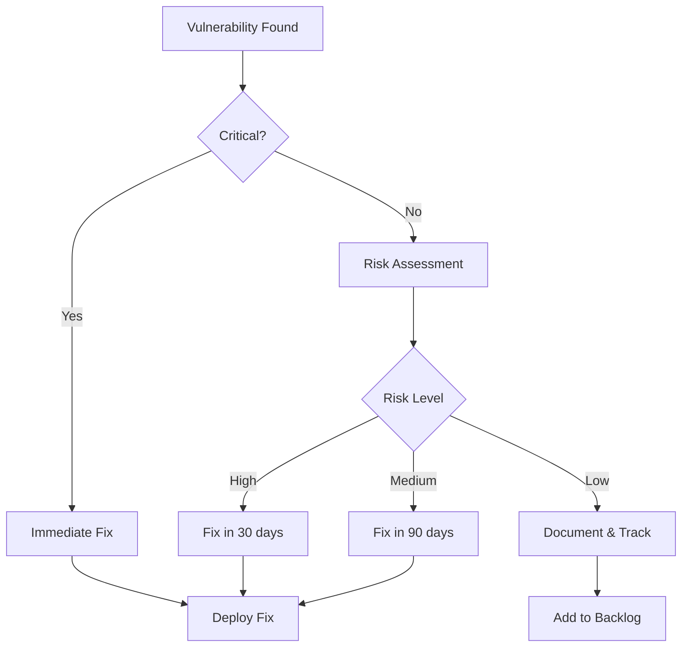

# Comprehensive Dependency Management & Security Scanning Guide

This guide provides a structured approach to identifying, documenting, and scanning dependencies for security issues using SonarQube and OWASP Dependency Check.

## Table of Contents
1. [Dependency Identification](#dependency-identification)
2. [Dependency Documentation](#dependency-documentation)
3. [SonarQube Quality Gates](#sonarqube-quality-gates)
4. [OWASP Dependency Check](#owasp-dependency-check)
5. [Remediation Planning](#remediation-planning)
6. [CI/CD Integration](#cicd-integration)

## Dependency Identification

### 1. Maven Project: List All Dependencies

```bash
# Basic dependency list
mvn dependency:list

# Hierarchical dependency tree
mvn dependency:tree

# Detailed dependency analysis showing used/unused
mvn dependency:analyze
```

### 2. Dependency Classification Matrix

Create a dependency inventory with the following attributes:

| Dependency | Version | Type | Usage | Source | License | Security Scan Required |
|------------|---------|------|-------|--------|---------|------------------------|
| spring-boot | 3.3.0 | Framework | Core application | Maven Central | Apache 2.0 | Yes |
| spring-cloud-netflix-eureka-server | 2023.0.2 | Library | Service Discovery | Maven Central | Apache 2.0 | Yes |
| ... | ... | ... | ... | ... | ... | ... |

Types to categorize:
- **Framework**: Foundational technology (Spring, Jakarta EE)
- **Library**: Reusable functionality (Apache Commons, Guava)
- **Tool**: Build-time component (Maven plugins)
- **Runtime**: Execution environment (Tomcat, JDK)

### 3. Transitive Dependency Analysis

```bash
# Analyze all transitive dependencies
mvn dependency:tree -Dverbose -DoutputFile=dependencies.txt

# Find a specific transitive dependency
mvn dependency:tree -Dincludes=org.apache.tomcat:*
```

### 4. Generate Dependency Reports

```bash
# Generate dependency reports
mvn site:site -DgenerateReports=true
```

## Dependency Documentation

### 1. Dependency Manifest

Create and maintain a `DEPENDENCIES.md` file that includes:

```markdown
# Project Dependencies

## Core Dependencies
- **Spring Boot** (3.3.0): Main application framework
  - License: Apache 2.0
  - Website: https://spring.io/projects/spring-boot
  - Security Notes: Critical component, requires regular updates

## Service Discovery
- **Spring Cloud Netflix** (2023.0.2): Eureka service registration
  - License: Apache 2.0
  - Website: https://spring.io/projects/spring-cloud-netflix
  - Security Notes: Contains legacy components with known vulnerabilities (XStream)

## Transitive Dependencies
- **Apache Tomcat** (10.1.24): Embedded servlet container
  - License: Apache 2.0
  - Website: https://tomcat.apache.org/
  - Security Notes: Critical infrastructure, follows suppression policy
```

### 2. Dependency Version Policy

Document your approach to dependency versioning:

```markdown
## Version Management Policy

1. **Critical Security Updates**: Apply within 7 days
2. **Major Version Upgrades**: Evaluate quarterly
3. **Minor Version Upgrades**: Evaluate monthly
4. **Version Pinning**: Pin all direct dependencies
5. **Compatibility Testing**: Required for all upgrades
```

## SonarQube Quality Gates

### 1. Configure Quality Gates for Dependencies

In SonarQube (https://sonarcloud.io):

1. Navigate to Quality Gates
2. Create or modify a gate for third-party code:

```
Quality Gate: "Third-Party Dependency Quality"

Conditions:
- Security Rating: A (no vulnerabilities)
- Security Hotspots Reviewed: 100%
- Duplicated Line Density: <5%
- Code Coverage: >80%
```

### 2. Set Quality Gate in pom.xml

```xml
<properties>
  <!-- SonarQube Quality Gate configuration -->
  <sonar.qualitygate.wait>true</sonar.qualitygate.wait>
</properties>
```

### 3. Define SonarQube Exclusions

```xml
<properties>
  <!-- Exclude generated code from analysis -->
  <sonar.exclusions>**/generated/**/*</sonar.exclusions>
  
  <!-- Exclude test code from duplication detection -->
  <sonar.cpd.exclusions>**/test/**/*</sonar.cpd.exclusions>
</properties>
```

## OWASP Dependency Check

### 1. Vulnerability Qualification Process

For each identified vulnerability:

1. **Assess Applicability**: Is the vulnerable functionality being used?
2. **Determine Severity**: What is the CVSS score and business impact?
3. **Evaluate Exploitability**: Is the vulnerability exploitable in your environment?
4. **Document Mitigation**: What compensating controls are in place?

### 2. Suppression Decision Matrix

| Scenario | Action | Documentation Requirements | Expiration |
|----------|--------|---------------------------|------------|
| False Positive | Suppress | Evidence of false positive | None |
| Not Applicable | Suppress | Usage analysis | 90 days |
| Mitigated | Suppress | Mitigation details | 90 days |
| Unavoidable | Suppress | Business justification | 30 days |
| Critical | Fix | Remediation plan | ASAP |

### 3. Suppression File Format

```xml
<suppress until="YYYY-MM-DD">
   <notes>
      CVE-XXXX-YYYY (CVSS Score): Brief description
      JUSTIFICATION: Why this is suppressed
      MITIGATION: How risk is addressed
      REMEDIATION PLAN: When it will be fixed
   </notes>
   <packageUrl regex="true">^pkg:maven/group\.id/artifact\.id@.*$</packageUrl>
   <cve>CVE-XXXX-YYYY</cve>
</suppress>
```

### 4. Threshold Configuration

```xml
<configuration>
    <!-- Fail on critical vulnerabilities -->
    <failBuildOnCVSS>9</failBuildOnCVSS>
    
    <!-- Control at runtime with property -->
    <failBuildOnAnyVulnerability>${dependency-check.failBuild:false}</failBuildOnAnyVulnerability>
</configuration>
```

## Remediation Planning

### 1. Vulnerability Response Workflow



### 2. Dependency Update Tracking

Create a `DEPENDENCY_UPDATES.md` file:

```markdown
# Dependency Update Tracking

## Critical Updates
| Dependency | Current | Target | CVE | Due Date | Status |
|------------|---------|--------|-----|----------|--------|
| tomcat-embed | 10.1.24 | 10.1.25 | CVE-2025-24813 | 2025-07-10 | Planned |

## Regular Updates
| Dependency | Current | Latest | Benefits | Planned | Status |
|------------|---------|--------|----------|---------|--------|
| spring-boot | 3.3.0 | 3.3.1 | Bug fixes | 2025-Q3 | Pending |
```

## CI/CD Integration

### 1. Pipeline Configuration

```yaml
jobs:
  security-scan:
    steps:
      - name: SonarQube Analysis
        run: mvn sonar:sonar -Dsonar.qualitygate.wait=true
        
      - name: OWASP Dependency Check
        run: |
          # First run without failing to capture reports
          mvn org.owasp:dependency-check-maven:check -Dfailbuild=false
          
          # Then enforce policy if required
          if [ "$ENFORCE_SECURITY_POLICY" == "true" ]; then
            mvn org.owasp:dependency-check-maven:check
          fi
```

### 2. Scan Schedule

```markdown
## Security Scan Schedule

| Scan Type | Frequency | Enforcement | Report Location |
|-----------|-----------|-------------|-----------------|
| SonarQube | Every commit | Enforced | sonarcloud.io |
| OWASP Dependency Check | Every commit | Enforced for critical | CI artifacts |
| Full Vulnerability Scan | Weekly | Manual review | Security team |
```

### 3. Scan Result Handling

```markdown
## Scan Result Response Protocol

1. **New Critical Vulnerability**
   - Notify security team immediately
   - Create high-priority ticket
   - Schedule remediation within 7 days

2. **New High Vulnerability**
   - Create medium-priority ticket
   - Schedule remediation within 30 days
   - Document mitigation in suppression file

3. **Failed Quality Gate**
   - Investigate root cause
   - Fix issues or adjust thresholds with justification
   - Document decisions in PR
```

## Best Practices

1. **Regular Dependency Audits**: Schedule quarterly reviews of all dependencies
2. **Automated Updates**: Use tools like Dependabot for automatic update PRs
3. **Dependency Consolidation**: Reduce total dependencies where possible
4. **License Compliance**: Track and verify license compatibility
5. **Vulnerability Monitoring**: Subscribe to security advisories for key dependencies
6. **Documentation**: Keep dependency documentation current with each change

## Appendix: Useful Commands

```bash
# List direct dependencies
mvn dependency:list -DincludeScope=compile

# Find vulnerable dependencies
mvn org.owasp:dependency-check-maven:check -DskipProjects

# Check for newer versions of dependencies
mvn versions:display-dependency-updates

# Generate dependency licenses report
mvn license:aggregate-download-licenses
```

By following this guide, you'll establish a robust process for managing dependencies and security scanning in your project.