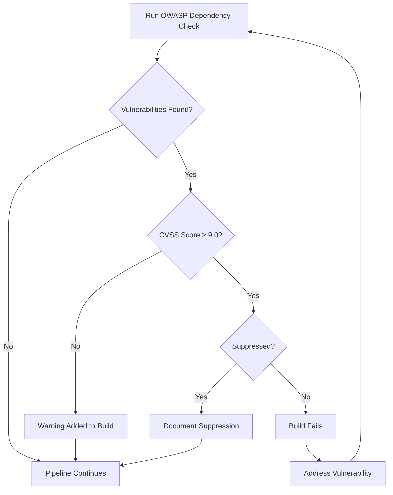

# OWASP Dependency Check Integration Guide

This document outlines the integration of OWASP Dependency Check into the CI/CD pipeline and provides guidance for developers on managing vulnerabilities.

## Table of Contents
1. [Overview](#overview)
2. [Configuration](#configuration)
3. [Vulnerability Management Process](#vulnerability-management-process)
4. [Working with Suppressions](#working-with-suppressions)
5. [Interpreting Results](#interpreting-results)
6. [Troubleshooting](#troubleshooting)

## Overview

OWASP Dependency Check is a Software Composition Analysis (SCA) tool that detects publicly disclosed vulnerabilities in project dependencies. The tool analyzes application dependencies and identifies any known Common Platform Enumeration (CPE) identifiers contained within the dependency's manifest.

### Key Features Enabled
- Automatic vulnerability detection for Maven dependencies
- HTML, XML, and JSON report generation
- Suppression mechanism for false positives or accepted risks
- Integration with GitHub Actions CI/CD pipeline
- Focus on Critical vulnerabilities (CVSS ≥ 9.0)

## Configuration

### Maven Plugin Configuration (pom.xml)

```xml
<plugin>
    <groupId>org.owasp</groupId>
    <artifactId>dependency-check-maven</artifactId>
    <version>8.2.1</version>
    <configuration>
        <formats>
            <format>HTML</format>
            <format>XML</format>
            <format>JSON</format>
        </formats>
        <failBuildOnCVSS>9</failBuildOnCVSS>
        <suppressionFiles>
            <suppressionFile>dependency-check-suppressions.xml</suppressionFile>
        </suppressionFiles>
        <assemblyAnalyzerEnabled>true</assemblyAnalyzerEnabled>
        <ossindexAnalyzerEnabled>false</ossindexAnalyzerEnabled>
        <knownExploitedEnabled>true</knownExploitedEnabled>
        <failBuildOnAnyVulnerability>${dependency-check.failBuild:false}</failBuildOnAnyVulnerability>
    </configuration>
</plugin>
```

### Important Configuration Parameters

| Parameter | Value | Description |
|-----------|-------|-------------|
| failBuildOnCVSS | 9 | Fails build for Critical vulnerabilities (CVSS ≥ 9.0) |
| suppressionFiles | dependency-check-suppressions.xml | XML file containing vulnerability suppressions |
| assemblyAnalyzerEnabled | true | Enables .NET assembly analysis |
| ossindexAnalyzerEnabled | false | Disables OSS Index lookup (reduces rate limiting issues) |
| knownExploitedEnabled | true | Checks against CISA Known Exploited Vulnerabilities catalog |

### CI/CD Integration

The GitHub Actions workflow is configured to:

1. Run dependency checks as part of the Build and Test job
2. Continue the build even if vulnerabilities are found (configurable)
3. Upload reports as artifacts for review
4. Display warnings in the pipeline for identified vulnerabilities

## Vulnerability Management Process

### Workflow



### Severity Levels and Actions

| CVSS Score | Severity | Build Action | Required Response |
|------------|----------|-------------|-------------------|
| 9.0 - 10.0 | Critical | Fail (unless suppressed) | Fix within 30 days |
| 7.0 - 8.9 | High | Warning | Fix within 90 days |
| 4.0 - 6.9 | Medium | Note in report | Fix within 180 days |
| 0.0 - 3.9 | Low | Note in report | Fix during regular updates |

## Working with Suppressions

### When to Suppress

Suppressions should only be used in the following circumstances:

1. **False Positives**: When a vulnerability doesn't apply to how we use the component
2. **Compensating Controls**: When other security measures mitigate the risk
3. **No Immediate Fix**: When a fix isn't available and the vulnerability isn't exploitable
4. **Scheduled Fix**: When a fix is planned and documented

### Suppression File Structure

```xml
<suppress until="YYYY-MM-DD">
   <notes>
      CVE-XXXX-YYYY (CVSS Score): Brief description of vulnerability
      JUSTIFICATION: Why this vulnerability is being suppressed
      MITIGATION: Steps taken to mitigate risk
      REMEDIATION PLAN: When and how this will be addressed
   </notes>
   <packageUrl regex="true">^pkg:maven/group\.id/artifact\.id@.*$</packageUrl>
   <cve>CVE-XXXX-YYYY</cve>
</suppress>
```

### Required Elements

- **until attribute**: Expiration date (max 90 days)
- **notes**: Must include CVE ID, CVSS score, justification, mitigation, and remediation plan
- **packageUrl**: Maven coordinates of the affected package
- **cve** or **vulnerabilityName**: Specific vulnerability identifier

### Review Process

1. Developer identifies vulnerability that needs suppression
2. Developer documents justification, mitigation, and remediation plan
3. Security team reviews and approves suppression
4. Suppression is added to suppressions file with expiration date
5. Suppression is reviewed before expiration

## Interpreting Results

### Report Locations

- HTML Report: `target/dependency-check-report.html`
- XML Report: `target/dependency-check-report.xml`
- JSON Report: `target/dependency-check-report.json`

### Key Sections in the HTML Report

1. **Summary**: Overview of dependencies scanned and vulnerabilities found
2. **Dependencies**: List of all dependencies analyzed
3. **Vulnerabilities**: Detailed information about each vulnerability
4. **Suppressed Vulnerabilities**: List of suppressed vulnerabilities

### Understanding Vulnerability Information

Each vulnerability contains:
- CVE ID and CVSS Score
- Description of the vulnerability
- Affected versions
- References to more information
- Recommended fixes

## Troubleshooting

### Common Issues

1. **False Positives**: Use suppressions with proper documentation
2. **Build Failures**: Check for critical vulnerabilities or update suppressions
3. **Slow Analysis**: Consider using the central cache or excluding unnecessary analyzers
4. **Network Issues**: Configure proxy settings if needed

### Running Dependency Check Locally

```bash
# To check dependencies without failing the build
mvn org.owasp:dependency-check-maven:check -Dfailbuild=false

# To generate only the reports
mvn org.owasp:dependency-check-maven:aggregate

# To update the NVD data only
mvn org.owasp:dependency-check-maven:update-only
```

### Getting Help

For issues with OWASP Dependency Check:
- [Official Documentation](https://jeremylong.github.io/DependencyCheck/)
- [GitHub Repository](https://github.com/jeremylong/DependencyCheck)
- Contact your security team at security@consultingfirm.com